# Тестування працездатності системи
---

### Server start running
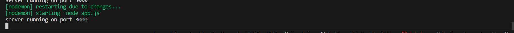

---

### Create file with info
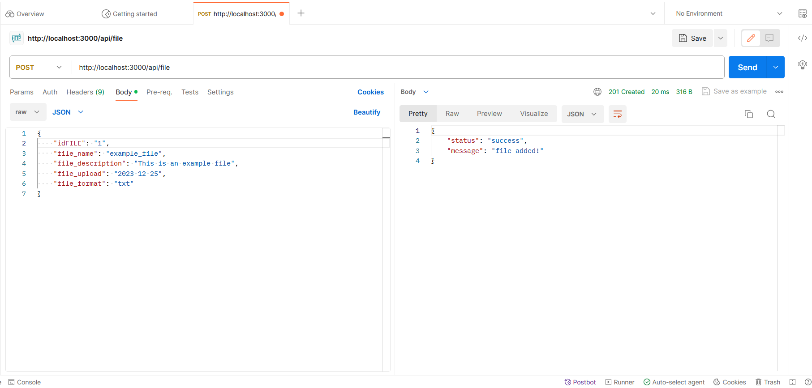

---

### Get created info
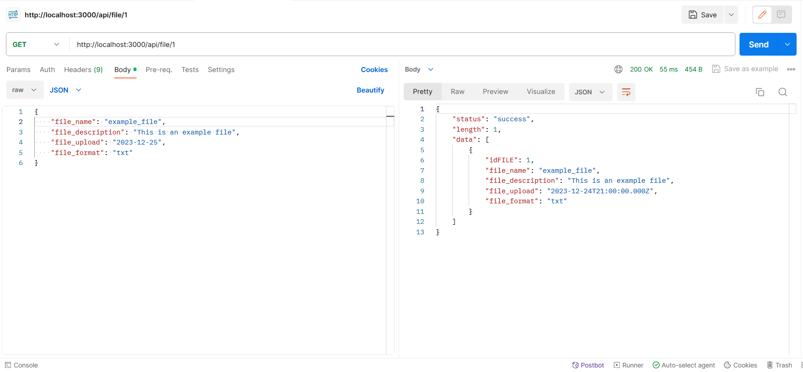

--- 

### Change created info
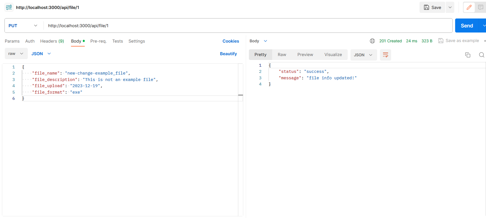

---

### Show changed created info
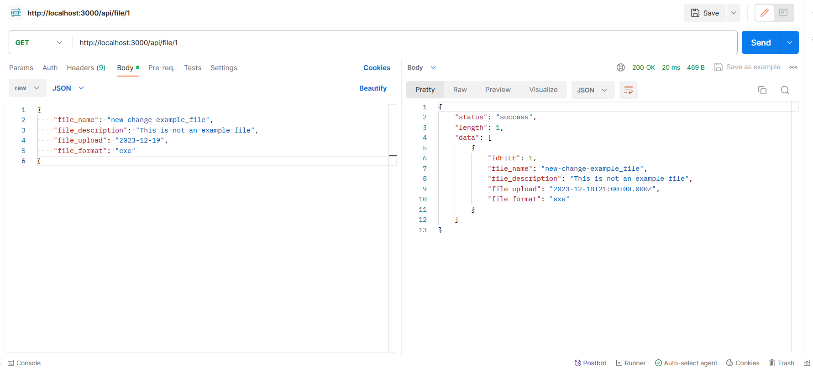

---

### Delate our 1 file 
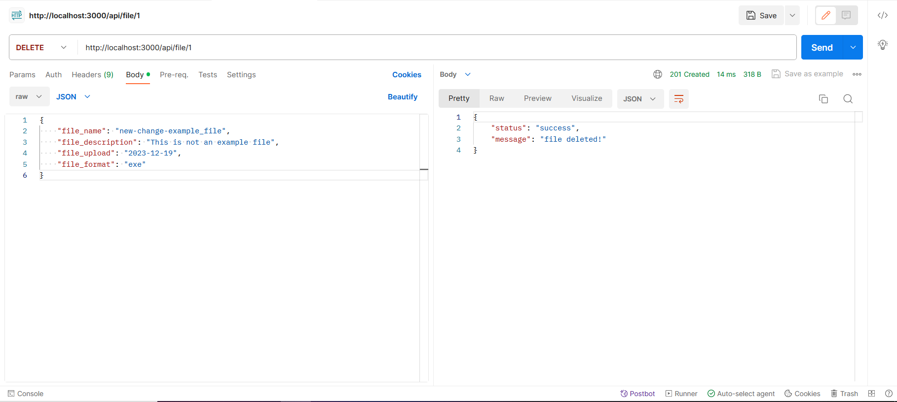

---

### Result of delating 1 file 
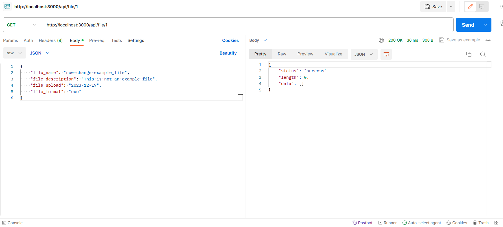

---

### Add 3 files 
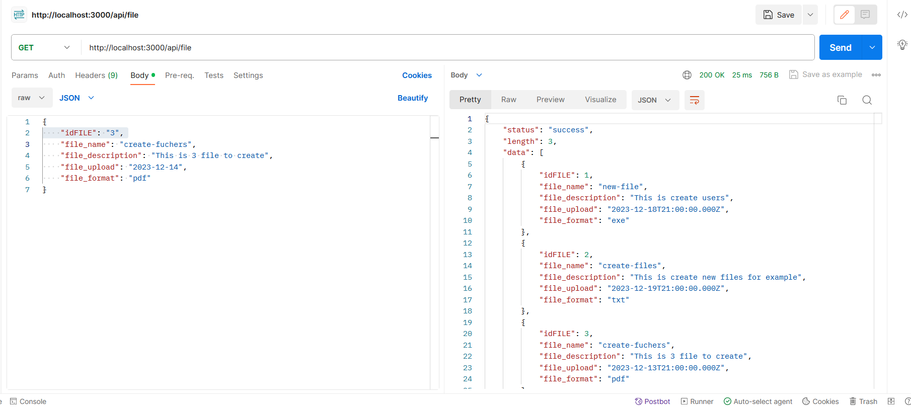

---

### Get 2 file from 3 files 
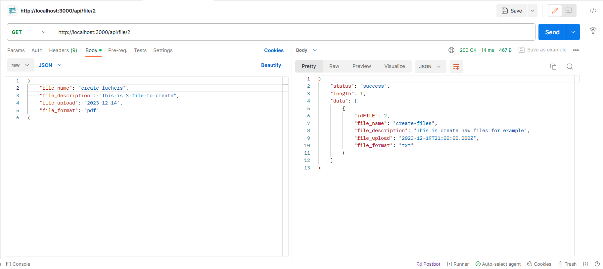

---

### Delate file 3 from 3 files 
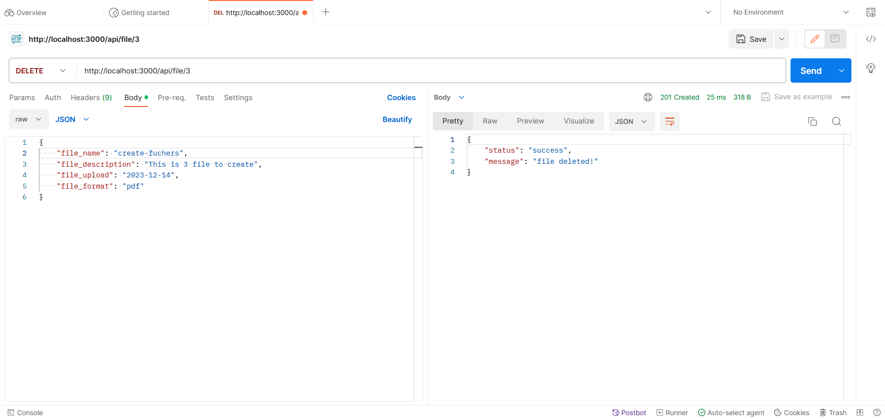

---

### Show file 3 from 3 files 
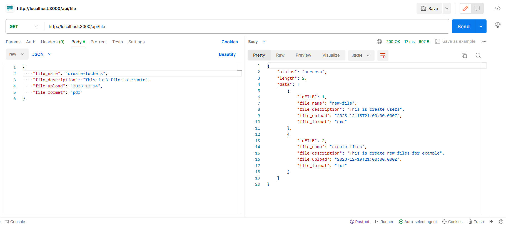

---

### Change file 2 from files 
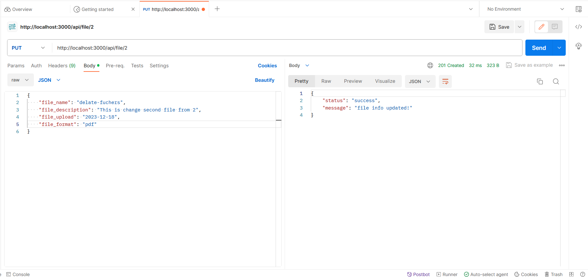

---

### Result of files
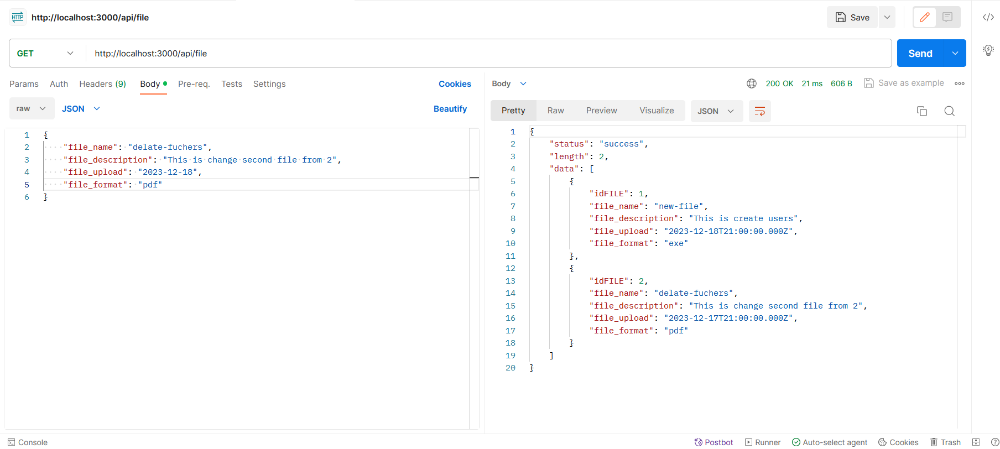
